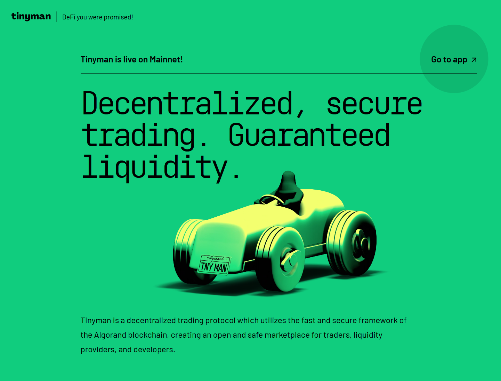
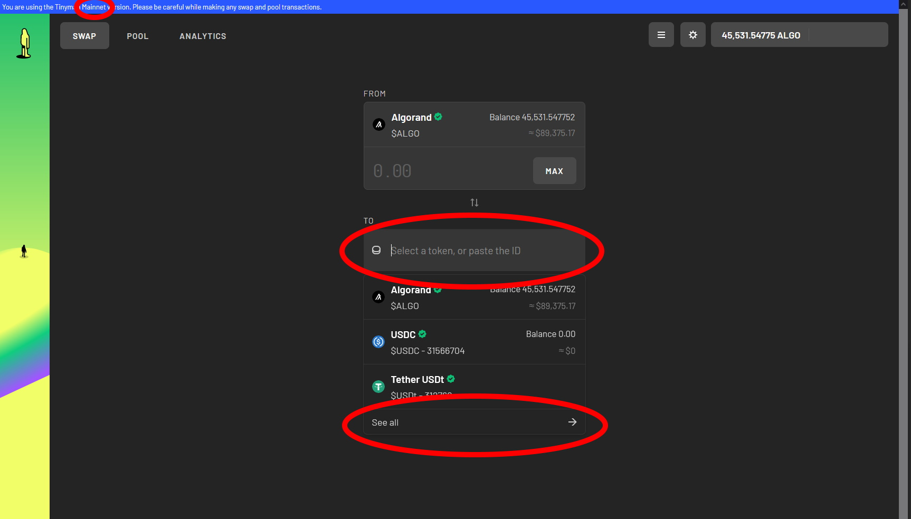
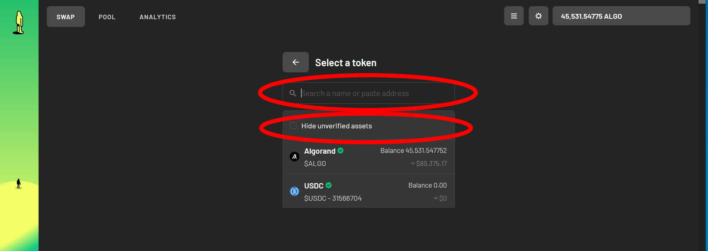
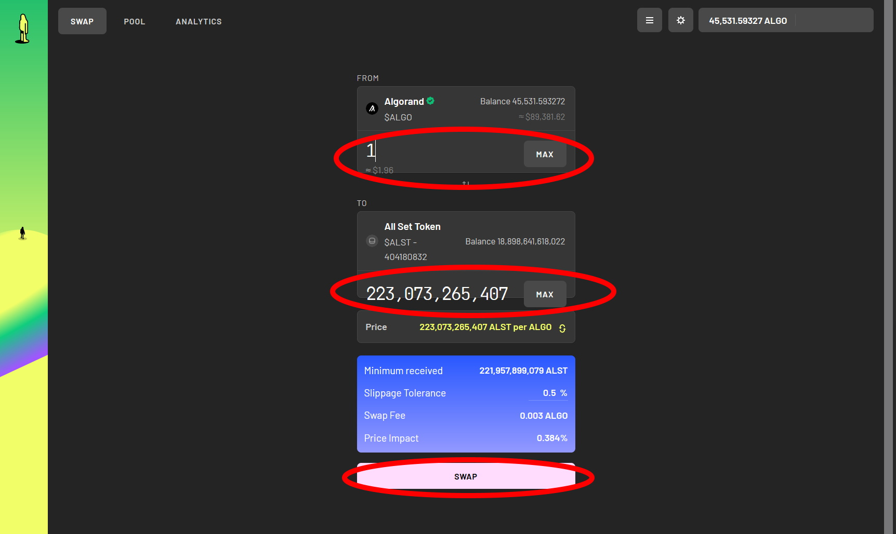

# How to Buy

## Before you buy

You need to have a ALGO Wallet.  You could set up a wallet for free at:

1. [Algo Official Wallet](https://algorandwallet.com) (IOS or Android)
2. [Algosigner](https://www.purestake.com/technology/algosigner/) (Chrome extension)
3. [My Algo](https://wallet.myalgo.com)

And you need ALGO.  You could buy ALGO at CEX like Binance and Coinbase.  Then you need to withdraw the ALGO into your wallet set above.

## Swapping in Tinyman

1. Go to [tinyman.org](https://tinyman.org). Then click "Go to app" in upper right corner.

2\. Then make sure it is in mainnet on the upper left.  Click "Connect" to connect your wallet in the upper right.  Then click "To" field and click "See All".

3\. Uncheck "Hide unverified assets" and input **404180832 **in the search field.  Choose All Set Token $ALST in the drop down list.

4\. Press "Opt In" to add the token address to your wallet.  This is a required procedure for once.  Then input the amount you desired to swapped and click "Swap"

5\. Transaction complete.  You are ALL SET!
