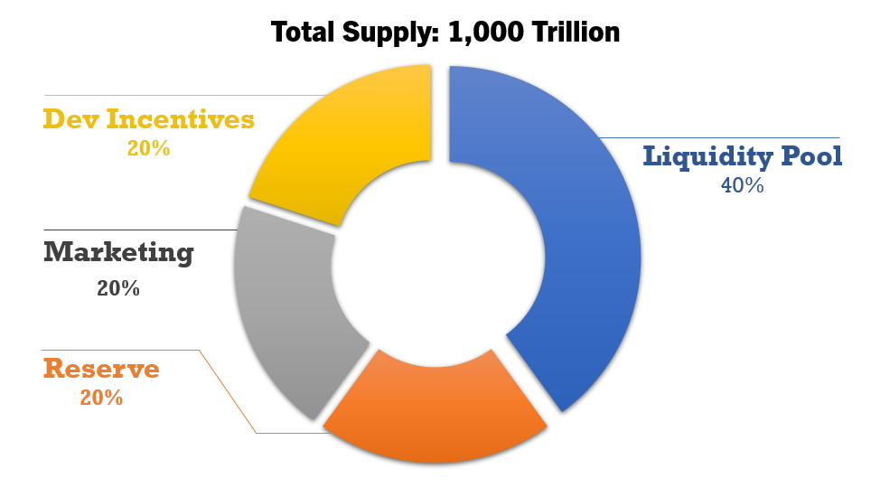

# Tokenomics

## Supply Distribution

## Outline

The world population now is around 8 billion in 2021.

We believe all people in the world have the right to use ALST, with 100,000 tokens each.  And a 20% reserved for future growth. (8 Billion + 2 Billion reserve) X 100,000)

**The total supply of ALST token is set at 1,000 Trillion**

## Liquidity Pool

400 Trillion ALST (40%) is paired with 800 Algo from the Token Creator in Tinyman.  This pair constitute the initial liquidity pool for public swapping.  Up to now, this pool is the only source of  circulating supply in the market.

400 Trillion : 800 Algo made the initial price of ALST to be 0.000000000002.  The price is intentionally small to facilitate active involvement and investment during the project lifespan.

## Dev Incentives and Marketing

200 Trillion (20%) reserved for development incentives.

200 Trillion (20%) reserved for Marketing.  Marketing is planned to start once the project reach the stage ALST listed in major CEX or DEX.

## Inflation

Current Algorand protocol limits the change of parameter after token creation.  Therefore, 20% of total supply is reserved to make ALST as an inflationary token.  Inflation is initially set to start after 3 years at the annual rate of 1% of total supply.  The token is used to support ecosystem continuing growth.
