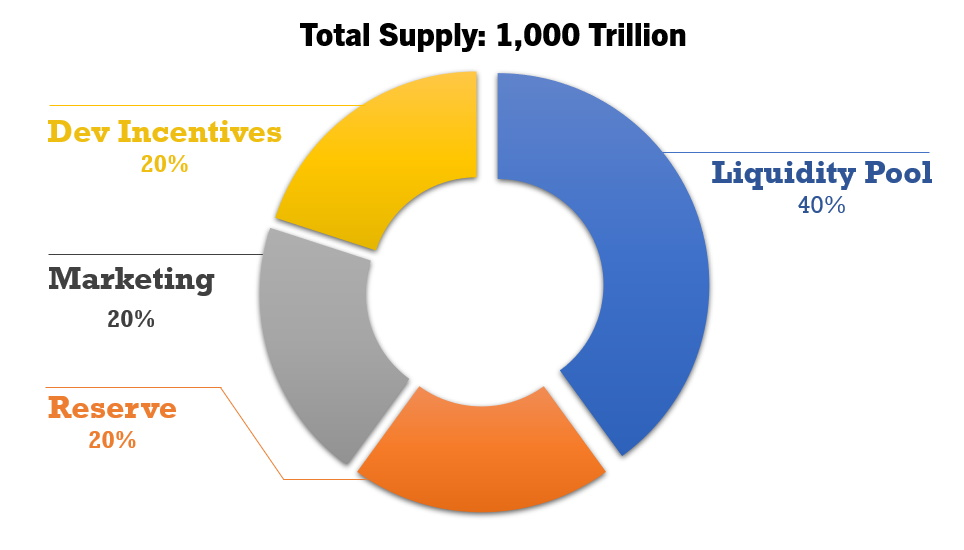

# Tokenomics

## Supply Distribution

## Outline

The world population now is around 8 billion in 2021.

We believe all people in the world have the right to use ALST, with 100,000 tokens each.  And a 20% reserved for future growth. (8 Billion + 2 Billion reserve) X 100,000)

**The total supply of ALST token is set at 1,000 Trillion**

